# DuiJie 系统架构与数据流程图

## 一、系统整体架构

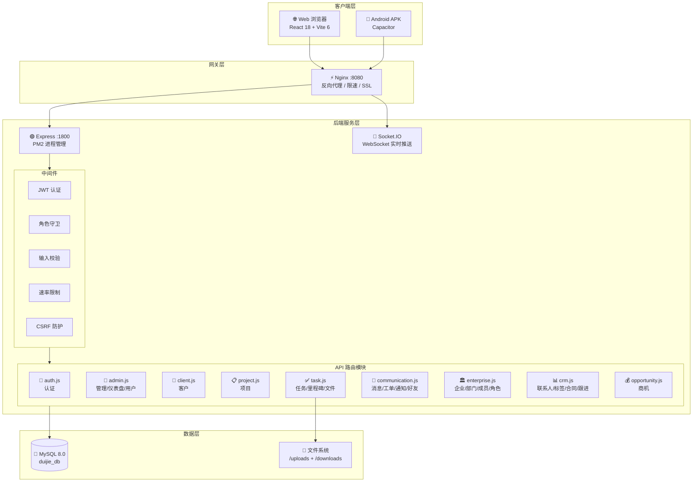
```mermaid
graph TB
    subgraph 客户端["客户端层"]
        WEB["🌐 Web 浏览器<br/>React 18 + Vite 6"]
        APK["📱 Android APK<br/>Capacitor"]
    end

    subgraph 网关["网关层"]
        NGINX["⚡ Nginx :8080<br/>反向代理 / 限速 / SSL"]
    end

    subgraph 后端["后端服务层"]
        EXPRESS["🟢 Express :1800<br/>PM2 进程管理"]
        SOCKET["🔌 Socket.IO<br/>WebSocket 实时推送"]
        
        subgraph 路由模块["API 路由模块"]
            AUTH["🔑 auth.js<br/>认证"]
            ADMIN["👤 admin.js<br/>管理/仪表盘/用户"]
            CLIENT["🏢 client.js<br/>客户"]
            PROJECT["📋 project.js<br/>项目"]
            TASK["✅ task.js<br/>任务/里程碑/文件"]
            COMM["💬 communication.js<br/>消息/工单/通知/好友"]
            ENTERPRISE["🏛 enterprise.js<br/>企业/部门/成员/角色"]
            CRM["📊 crm.js<br/>联系人/标签/合同/跟进"]
            OPP["💰 opportunity.js<br/>商机"]
        end

        subgraph 中间件["中间件"]
            MW_AUTH["JWT 认证"]
            MW_ROLE["角色守卫"]
            MW_VALID["输入校验"]
            MW_RATE["速率限制"]
            MW_CSRF["CSRF 防护"]
        end
    end

    subgraph 数据层["数据层"]
        MYSQL[("🐬 MySQL 8.0<br/>duijie_db")]
        FS["📂 文件系统<br/>/uploads + /downloads"]
    end

    WEB --> NGINX
    APK --> NGINX
    NGINX --> EXPRESS
    NGINX --> SOCKET
    EXPRESS --> 中间件 --> 路由模块
    路由模块 --> MYSQL
    TASK --> FS
```

## 二、前端模块关系图

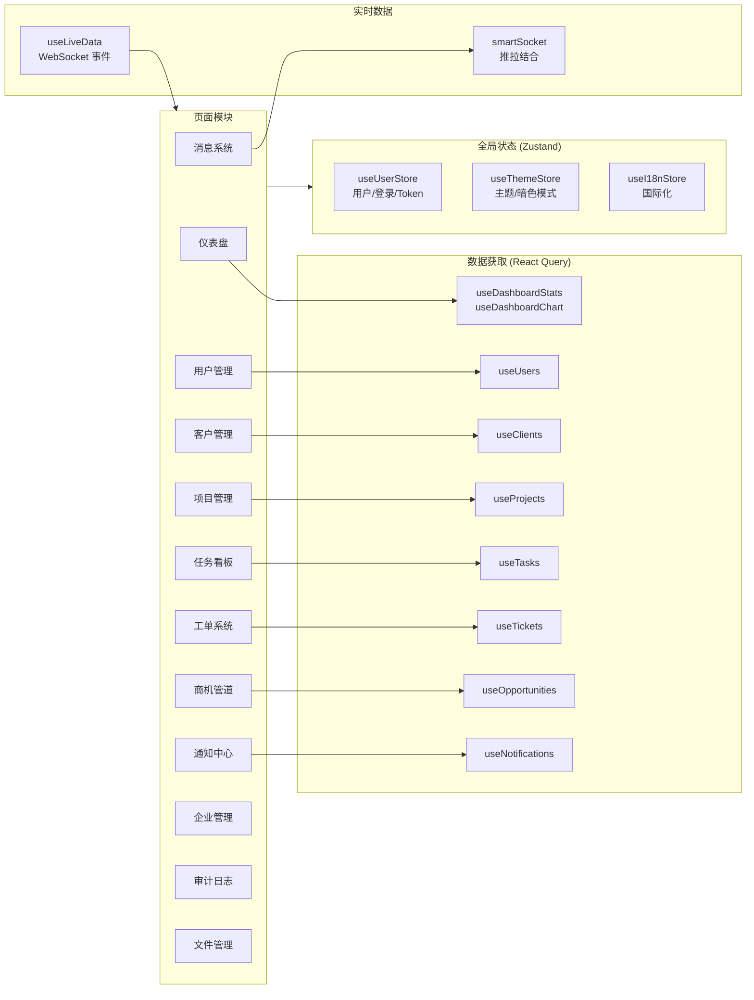
```mermaid
graph LR
    subgraph 核心状态["全局状态 (Zustand)"]
        USER_STORE["useUserStore<br/>用户/登录/Token"]
        THEME_STORE["useThemeStore<br/>主题/暗色模式"]
        I18N_STORE["useI18nStore<br/>国际化"]
    end

    subgraph 数据层["数据获取 (React Query)"]
        RQ_DASH["useDashboardStats<br/>useDashboardChart"]
        RQ_USER["useUsers"]
        RQ_CLIENT["useClients"]
        RQ_PROJECT["useProjects"]
        RQ_TASK["useTasks"]
        RQ_TICKET["useTickets"]
        RQ_OPP["useOpportunities"]
        RQ_NOTIFY["useNotifications"]
    end

    subgraph 实时同步["实时数据"]
        LIVE["useLiveData<br/>WebSocket 事件"]
        SMART["smartSocket<br/>推拉结合"]
    end

    subgraph 页面模块["页面模块"]
        DASH["仪表盘"] --> RQ_DASH
        USERS["用户管理"] --> RQ_USER
        CLIENTS["客户管理"] --> RQ_CLIENT
        PROJECTS["项目管理"] --> RQ_PROJECT
        TASKS["任务看板"] --> RQ_TASK
        TICKETS["工单系统"] --> RQ_TICKET
        OPPS["商机管道"] --> RQ_OPP
        NOTIFS["通知中心"] --> RQ_NOTIFY
        MSG["消息系统"] --> SMART
        ENT["企业管理"]
        AUDIT["审计日志"]
        FILES["文件管理"]
    end

    页面模块 --> 核心状态
    LIVE --> 页面模块
```

## 三、各模块数据流程图

### 1. 认证模块 (auth)

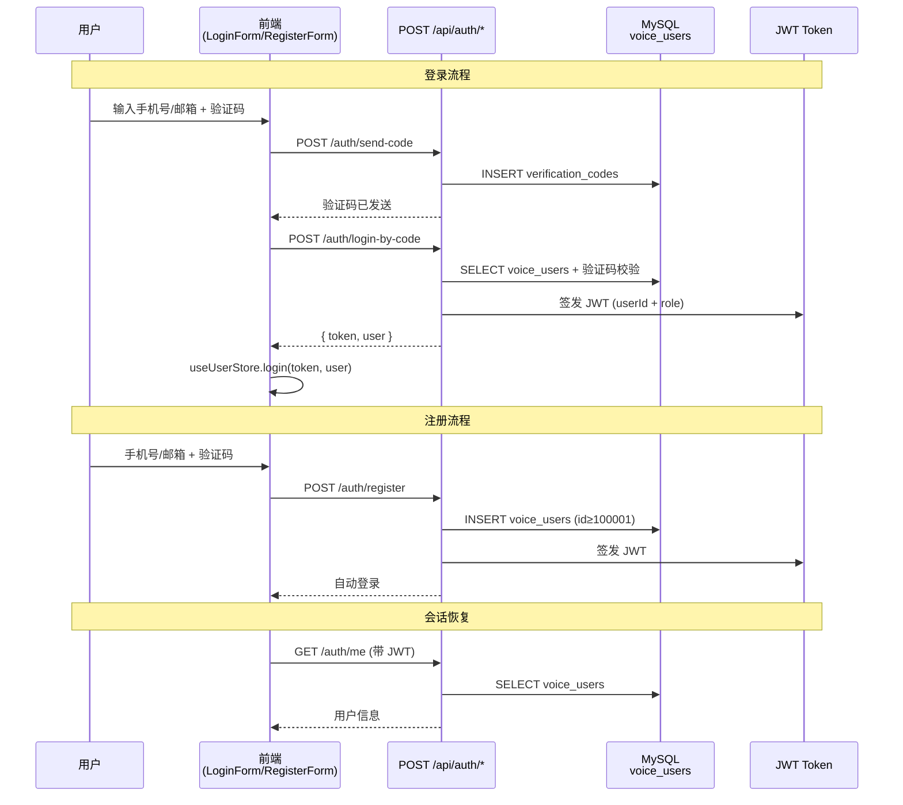
```mermaid
sequenceDiagram
    participant U as 用户
    participant FE as 前端<br/>(LoginForm/RegisterForm)
    participant API as POST /api/auth/*
    participant DB as MySQL<br/>voice_users
    participant JWT as JWT Token

    Note over U,JWT: 登录流程
    U->>FE: 输入手机号/邮箱 + 验证码
    FE->>API: POST /auth/send-code
    API->>DB: INSERT verification_codes
    API-->>FE: 验证码已发送
    FE->>API: POST /auth/login-by-code
    API->>DB: SELECT voice_users + 验证码校验
    API->>JWT: 签发 JWT (userId + role)
    API-->>FE: { token, user }
    FE->>FE: useUserStore.login(token, user)

    Note over U,JWT: 注册流程
    U->>FE: 手机号/邮箱 + 验证码
    FE->>API: POST /auth/register
    API->>DB: INSERT voice_users (id≥100001)
    API->>JWT: 签发 JWT
    API-->>FE: 自动登录

    Note over U,JWT: 会话恢复
    FE->>API: GET /auth/me (带 JWT)
    API->>DB: SELECT voice_users
    API-->>FE: 用户信息
```

### 2. 仪表盘模块 (dashboard)

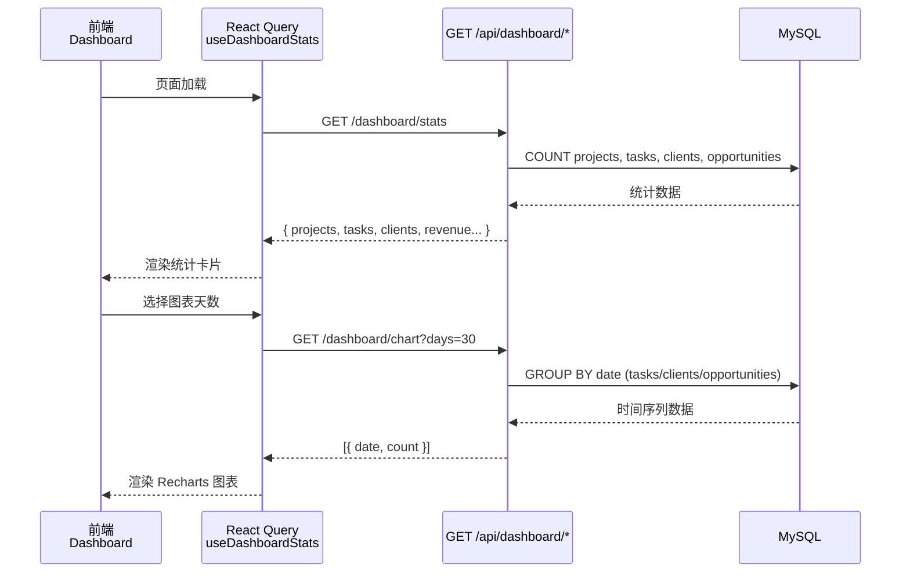
```mermaid
sequenceDiagram
    participant FE as 前端<br/>Dashboard
    participant RQ as React Query<br/>useDashboardStats
    participant API as GET /api/dashboard/*
    participant DB as MySQL

    FE->>RQ: 页面加载
    RQ->>API: GET /dashboard/stats
    API->>DB: COUNT projects, tasks, clients, opportunities
    DB-->>API: 统计数据
    API-->>RQ: { projects, tasks, clients, revenue... }
    RQ-->>FE: 渲染统计卡片

    FE->>RQ: 选择图表天数
    RQ->>API: GET /dashboard/chart?days=30
    API->>DB: GROUP BY date (tasks/clients/opportunities)
    DB-->>API: 时间序列数据
    API-->>RQ: [{ date, count }]
    RQ-->>FE: 渲染 Recharts 图表
```

### 3. 客户管理模块 (client)

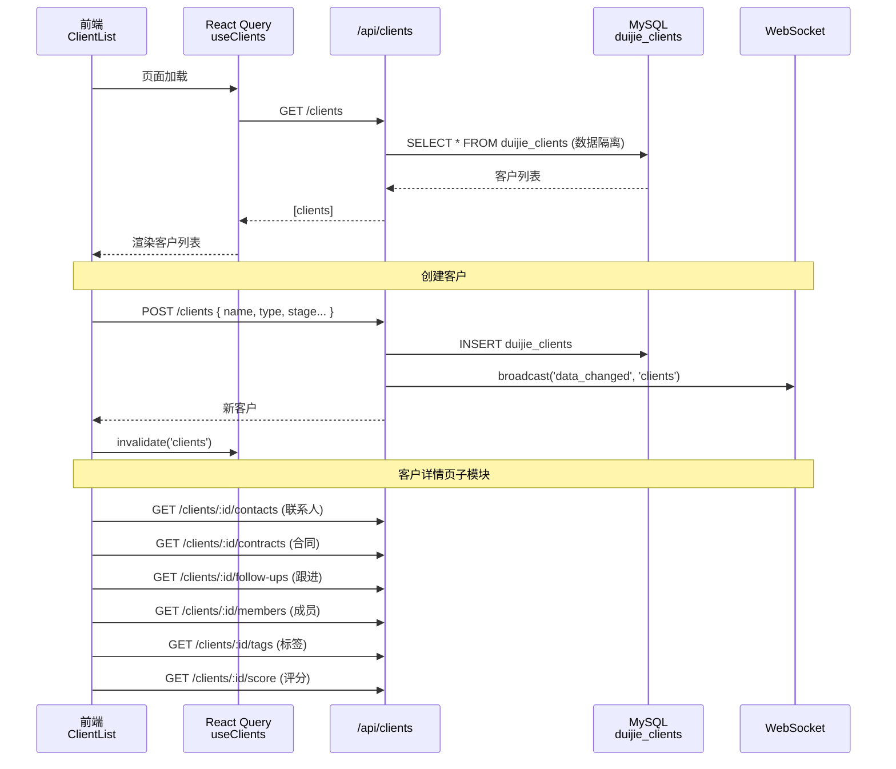
```mermaid
sequenceDiagram
    participant FE as 前端<br/>ClientList
    participant RQ as React Query<br/>useClients
    participant API as /api/clients
    participant DB as MySQL<br/>duijie_clients
    participant WS as WebSocket

    FE->>RQ: 页面加载
    RQ->>API: GET /clients
    API->>DB: SELECT * FROM duijie_clients (数据隔离)
    DB-->>API: 客户列表
    API-->>RQ: [clients]
    RQ-->>FE: 渲染客户列表

    Note over FE,WS: 创建客户
    FE->>API: POST /clients { name, type, stage... }
    API->>DB: INSERT duijie_clients
    API->>WS: broadcast('data_changed', 'clients')
    API-->>FE: 新客户
    FE->>RQ: invalidate('clients')

    Note over FE,WS: 客户详情页子模块
    FE->>API: GET /clients/:id/contacts (联系人)
    FE->>API: GET /clients/:id/contracts (合同)
    FE->>API: GET /clients/:id/follow-ups (跟进)
    FE->>API: GET /clients/:id/members (成员)
    FE->>API: GET /clients/:id/tags (标签)
    FE->>API: GET /clients/:id/score (评分)
```

### 4. 项目管理模块 (project)

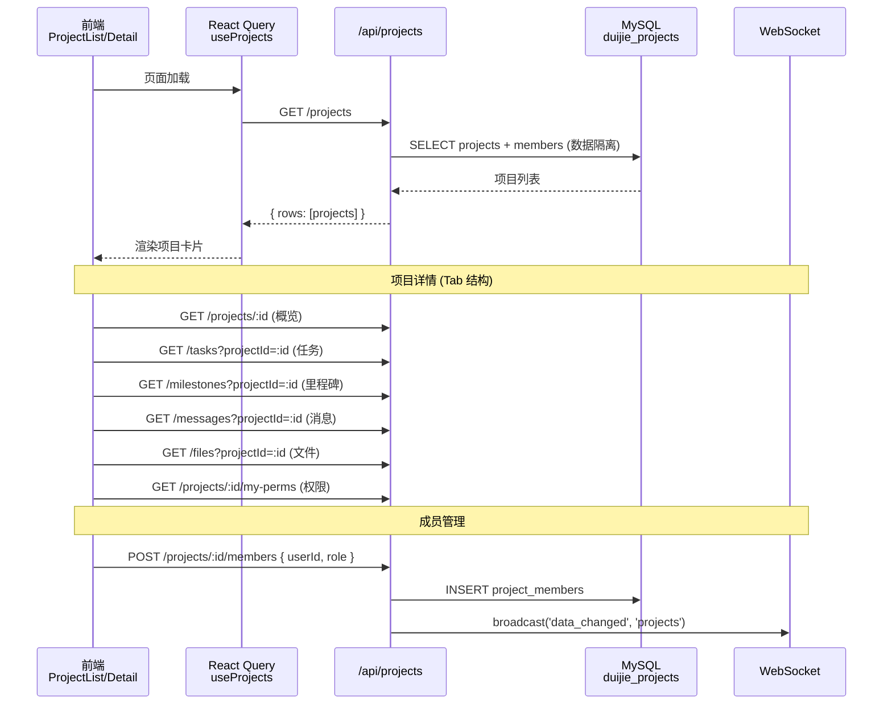
```mermaid
sequenceDiagram
    participant FE as 前端<br/>ProjectList/Detail
    participant RQ as React Query<br/>useProjects
    participant API as /api/projects
    participant DB as MySQL<br/>duijie_projects
    participant WS as WebSocket

    FE->>RQ: 页面加载
    RQ->>API: GET /projects
    API->>DB: SELECT projects + members (数据隔离)
    DB-->>API: 项目列表
    API-->>RQ: { rows: [projects] }
    RQ-->>FE: 渲染项目卡片

    Note over FE,WS: 项目详情 (Tab 结构)
    FE->>API: GET /projects/:id (概览)
    FE->>API: GET /tasks?projectId=:id (任务)
    FE->>API: GET /milestones?projectId=:id (里程碑)
    FE->>API: GET /messages?projectId=:id (消息)
    FE->>API: GET /files?projectId=:id (文件)
    FE->>API: GET /projects/:id/my-perms (权限)

    Note over FE,WS: 成员管理
    FE->>API: POST /projects/:id/members { userId, role }
    API->>DB: INSERT project_members
    API->>WS: broadcast('data_changed', 'projects')
```

### 5. 任务看板模块 (task)

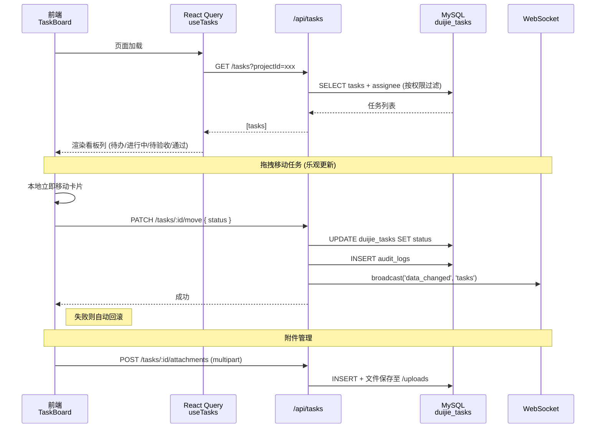
```mermaid
sequenceDiagram
    participant FE as 前端<br/>TaskBoard
    participant RQ as React Query<br/>useTasks
    participant API as /api/tasks
    participant DB as MySQL<br/>duijie_tasks
    participant WS as WebSocket

    FE->>RQ: 页面加载
    RQ->>API: GET /tasks?projectId=xxx
    API->>DB: SELECT tasks + assignee (按权限过滤)
    DB-->>API: 任务列表
    API-->>RQ: [tasks]
    RQ-->>FE: 渲染看板列 (待办/进行中/待验收/通过)

    Note over FE,WS: 拖拽移动任务 (乐观更新)
    FE->>FE: 本地立即移动卡片
    FE->>API: PATCH /tasks/:id/move { status }
    API->>DB: UPDATE duijie_tasks SET status
    API->>DB: INSERT audit_logs
    API->>WS: broadcast('data_changed', 'tasks')
    API-->>FE: 成功
    Note right of FE: 失败则自动回滚

    Note over FE,WS: 附件管理
    FE->>API: POST /tasks/:id/attachments (multipart)
    API->>DB: INSERT + 文件保存至 /uploads
```

### 6. 商机管道模块 (opportunity)

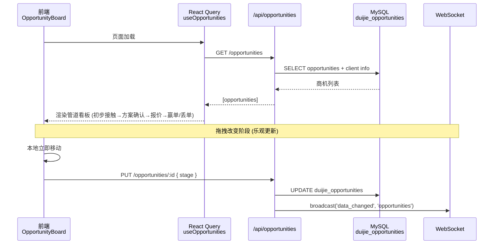
```mermaid
sequenceDiagram
    participant FE as 前端<br/>OpportunityBoard
    participant RQ as React Query<br/>useOpportunities
    participant API as /api/opportunities
    participant DB as MySQL<br/>duijie_opportunities
    participant WS as WebSocket

    FE->>RQ: 页面加载
    RQ->>API: GET /opportunities
    API->>DB: SELECT opportunities + client info
    DB-->>API: 商机列表
    API-->>RQ: [opportunities]
    RQ-->>FE: 渲染管道看板 (初步接触→方案确认→报价→赢单/丢单)

    Note over FE,WS: 拖拽改变阶段 (乐观更新)
    FE->>FE: 本地立即移动
    FE->>API: PUT /opportunities/:id { stage }
    API->>DB: UPDATE duijie_opportunities
    API->>WS: broadcast('data_changed', 'opportunities')
```

### 7. 消息系统模块 (messaging)

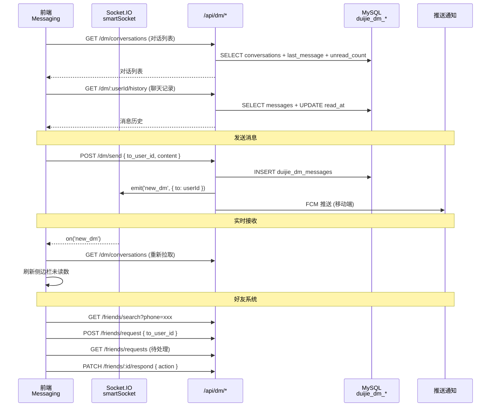
```mermaid
sequenceDiagram
    participant FE as 前端<br/>Messaging
    participant WS as Socket.IO<br/>smartSocket
    participant API as /api/dm/*
    participant DB as MySQL<br/>duijie_dm_*
    participant PUSH as 推送通知

    FE->>API: GET /dm/conversations (对话列表)
    API->>DB: SELECT conversations + last_message + unread_count
    API-->>FE: 对话列表

    FE->>API: GET /dm/:userId/history (聊天记录)
    API->>DB: SELECT messages + UPDATE read_at
    API-->>FE: 消息历史

    Note over FE,PUSH: 发送消息
    FE->>API: POST /dm/send { to_user_id, content }
    API->>DB: INSERT duijie_dm_messages
    API->>WS: emit('new_dm', { to: userId })
    API->>PUSH: FCM 推送 (移动端)

    Note over FE,PUSH: 实时接收
    WS-->>FE: on('new_dm')
    FE->>API: GET /dm/conversations (重新拉取)
    FE->>FE: 刷新侧边栏未读数

    Note over FE,PUSH: 好友系统
    FE->>API: GET /friends/search?phone=xxx
    FE->>API: POST /friends/request { to_user_id }
    FE->>API: GET /friends/requests (待处理)
    FE->>API: PATCH /friends/:id/respond { action }
```

### 8. 企业管理模块 (enterprise)

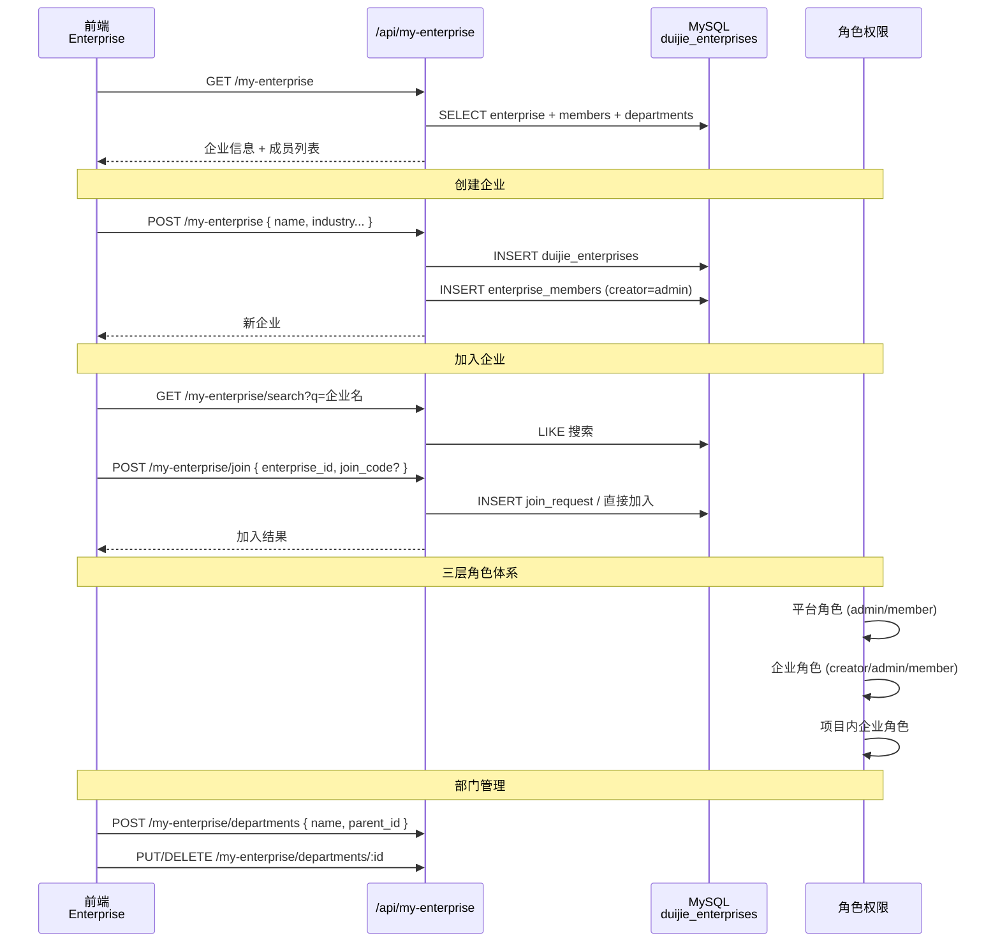
```mermaid
sequenceDiagram
    participant FE as 前端<br/>Enterprise
    participant API as /api/my-enterprise
    participant DB as MySQL<br/>duijie_enterprises
    participant ROLE as 角色权限

    FE->>API: GET /my-enterprise
    API->>DB: SELECT enterprise + members + departments
    API-->>FE: 企业信息 + 成员列表

    Note over FE,ROLE: 创建企业
    FE->>API: POST /my-enterprise { name, industry... }
    API->>DB: INSERT duijie_enterprises
    API->>DB: INSERT enterprise_members (creator=admin)
    API-->>FE: 新企业

    Note over FE,ROLE: 加入企业
    FE->>API: GET /my-enterprise/search?q=企业名
    API->>DB: LIKE 搜索
    FE->>API: POST /my-enterprise/join { enterprise_id, join_code? }
    API->>DB: INSERT join_request / 直接加入
    API-->>FE: 加入结果

    Note over FE,ROLE: 三层角色体系
    ROLE->>ROLE: 平台角色 (admin/member)
    ROLE->>ROLE: 企业角色 (creator/admin/member)
    ROLE->>ROLE: 项目内企业角色
    
    Note over FE,ROLE: 部门管理
    FE->>API: POST /my-enterprise/departments { name, parent_id }
    FE->>API: PUT/DELETE /my-enterprise/departments/:id
```

### 9. 工单系统模块 (ticket)

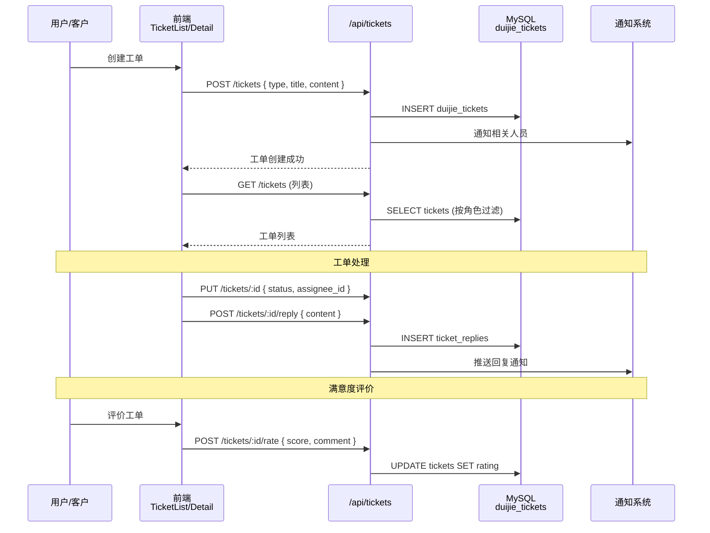
```mermaid
sequenceDiagram
    participant U as 用户/客户
    participant FE as 前端<br/>TicketList/Detail
    participant API as /api/tickets
    participant DB as MySQL<br/>duijie_tickets
    participant NOTIFY as 通知系统

    U->>FE: 创建工单
    FE->>API: POST /tickets { type, title, content }
    API->>DB: INSERT duijie_tickets
    API->>NOTIFY: 通知相关人员
    API-->>FE: 工单创建成功

    FE->>API: GET /tickets (列表)
    API->>DB: SELECT tickets (按角色过滤)
    API-->>FE: 工单列表

    Note over U,NOTIFY: 工单处理
    FE->>API: PUT /tickets/:id { status, assignee_id }
    FE->>API: POST /tickets/:id/reply { content }
    API->>DB: INSERT ticket_replies
    API->>NOTIFY: 推送回复通知

    Note over U,NOTIFY: 满意度评价
    U->>FE: 评价工单
    FE->>API: POST /tickets/:id/rate { score, comment }
    API->>DB: UPDATE tickets SET rating
```

### 10. 通知系统模块 (notification)

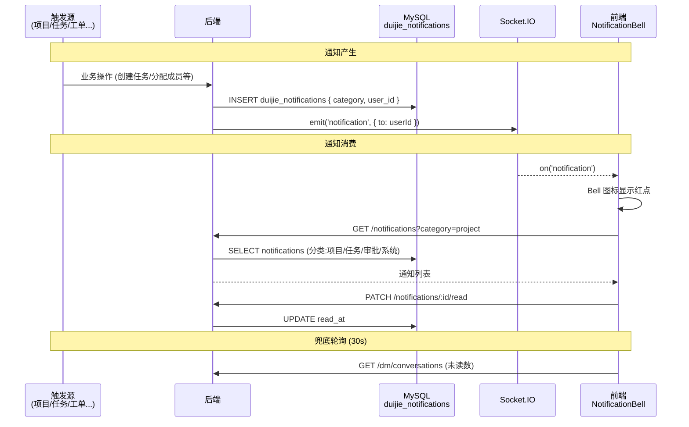
```mermaid
sequenceDiagram
    participant 触发源 as 触发源<br/>(项目/任务/工单...)
    participant API as 后端
    participant DB as MySQL<br/>duijie_notifications
    participant WS as Socket.IO
    participant FE as 前端<br/>NotificationBell

    Note over 触发源,FE: 通知产生
    触发源->>API: 业务操作 (创建任务/分配成员等)
    API->>DB: INSERT duijie_notifications { category, user_id }
    API->>WS: emit('notification', { to: userId })

    Note over 触发源,FE: 通知消费
    WS-->>FE: on('notification')
    FE->>FE: Bell 图标显示红点
    FE->>API: GET /notifications?category=project
    API->>DB: SELECT notifications (分类:项目/任务/审批/系统)
    API-->>FE: 通知列表

    FE->>API: PATCH /notifications/:id/read
    API->>DB: UPDATE read_at

    Note over 触发源,FE: 兜底轮询 (30s)
    FE->>API: GET /dm/conversations (未读数)
```

### 11. 用户管理模块 (user)

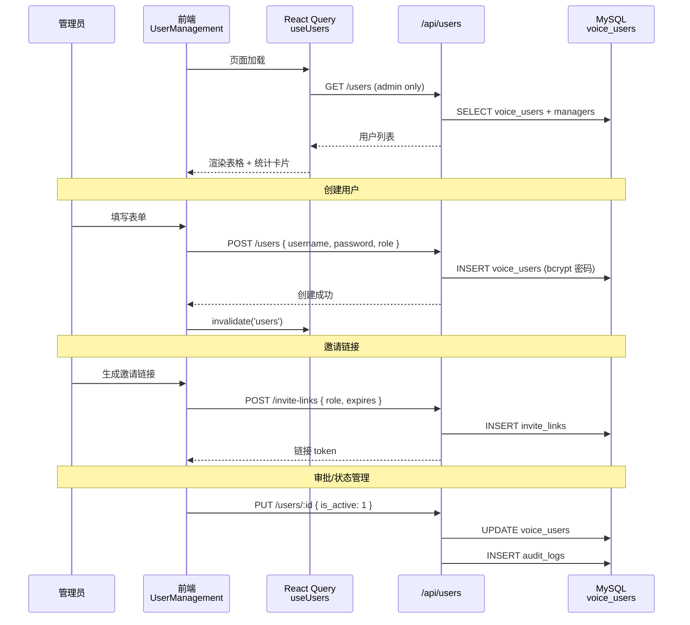
```mermaid
sequenceDiagram
    participant ADMIN as 管理员
    participant FE as 前端<br/>UserManagement
    participant RQ as React Query<br/>useUsers
    participant API as /api/users
    participant DB as MySQL<br/>voice_users

    FE->>RQ: 页面加载
    RQ->>API: GET /users (admin only)
    API->>DB: SELECT voice_users + managers
    API-->>RQ: 用户列表
    RQ-->>FE: 渲染表格 + 统计卡片

    Note over ADMIN,DB: 创建用户
    ADMIN->>FE: 填写表单
    FE->>API: POST /users { username, password, role }
    API->>DB: INSERT voice_users (bcrypt 密码)
    API-->>FE: 创建成功
    FE->>RQ: invalidate('users')

    Note over ADMIN,DB: 邀请链接
    ADMIN->>FE: 生成邀请链接
    FE->>API: POST /invite-links { role, expires }
    API->>DB: INSERT invite_links
    API-->>FE: 链接 token

    Note over ADMIN,DB: 审批/状态管理
    FE->>API: PUT /users/:id { is_active: 1 }
    API->>DB: UPDATE voice_users
    API->>DB: INSERT audit_logs
```

### 12. 审计日志模块 (audit)

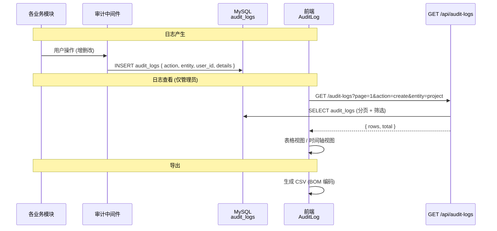
```mermaid
sequenceDiagram
    participant 业务模块 as 各业务模块
    participant MW as 审计中间件
    participant DB as MySQL<br/>audit_logs
    participant FE as 前端<br/>AuditLog
    participant API as GET /api/audit-logs

    Note over 业务模块,FE: 日志产生
    业务模块->>MW: 用户操作 (增删改)
    MW->>DB: INSERT audit_logs { action, entity, user_id, details }

    Note over 业务模块,FE: 日志查看 (仅管理员)
    FE->>API: GET /audit-logs?page=1&action=create&entity=project
    API->>DB: SELECT audit_logs (分页 + 筛选)
    API-->>FE: { rows, total }
    FE->>FE: 表格视图 / 时间轴视图

    Note over 业务模块,FE: 导出
    FE->>FE: 生成 CSV (BOM 编码)
```

### 13. 文件管理模块 (file)

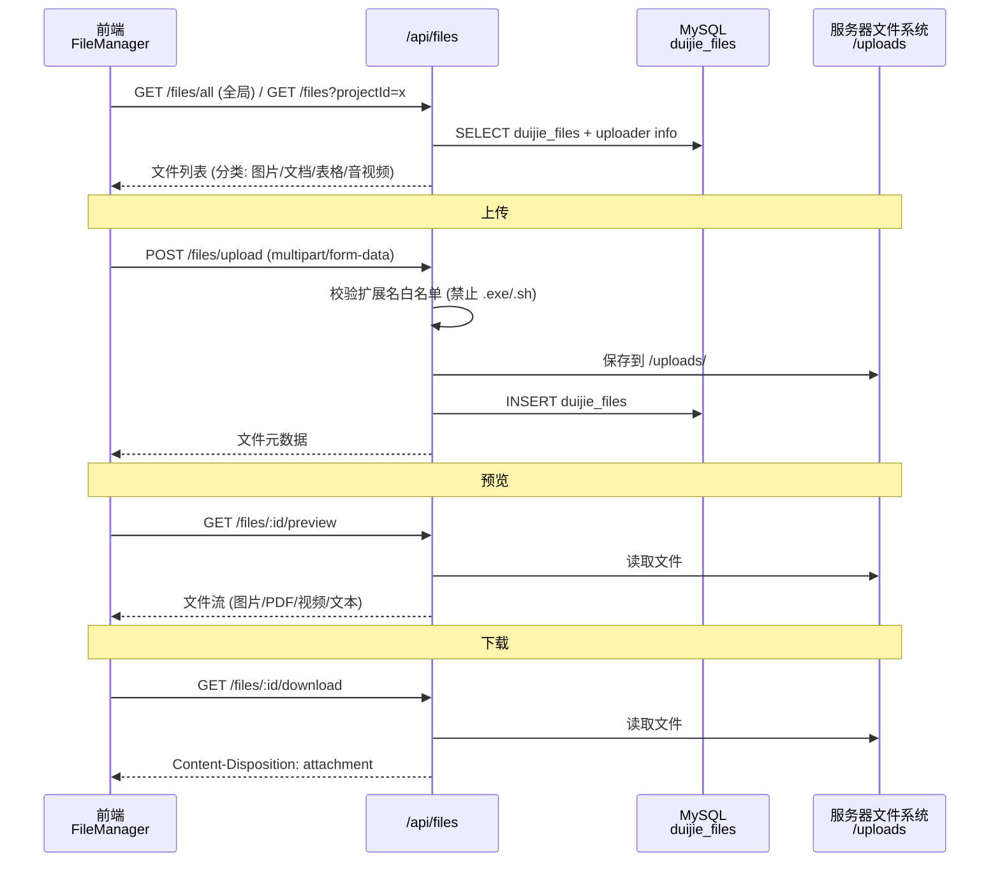
```mermaid
sequenceDiagram
    participant FE as 前端<br/>FileManager
    participant API as /api/files
    participant DB as MySQL<br/>duijie_files
    participant FS as 服务器文件系统<br/>/uploads

    FE->>API: GET /files/all (全局) / GET /files?projectId=x
    API->>DB: SELECT duijie_files + uploader info
    API-->>FE: 文件列表 (分类: 图片/文档/表格/音视频)

    Note over FE,FS: 上传
    FE->>API: POST /files/upload (multipart/form-data)
    API->>API: 校验扩展名白名单 (禁止 .exe/.sh)
    API->>FS: 保存到 /uploads/
    API->>DB: INSERT duijie_files
    API-->>FE: 文件元数据

    Note over FE,FS: 预览
    FE->>API: GET /files/:id/preview
    API->>FS: 读取文件
    API-->>FE: 文件流 (图片/PDF/视频/文本)

    Note over FE,FS: 下载
    FE->>API: GET /files/:id/download
    API->>FS: 读取文件
    API-->>FE: Content-Disposition: attachment
```

### 14. CRM 子模块 (联系人/标签/合同/跟进)

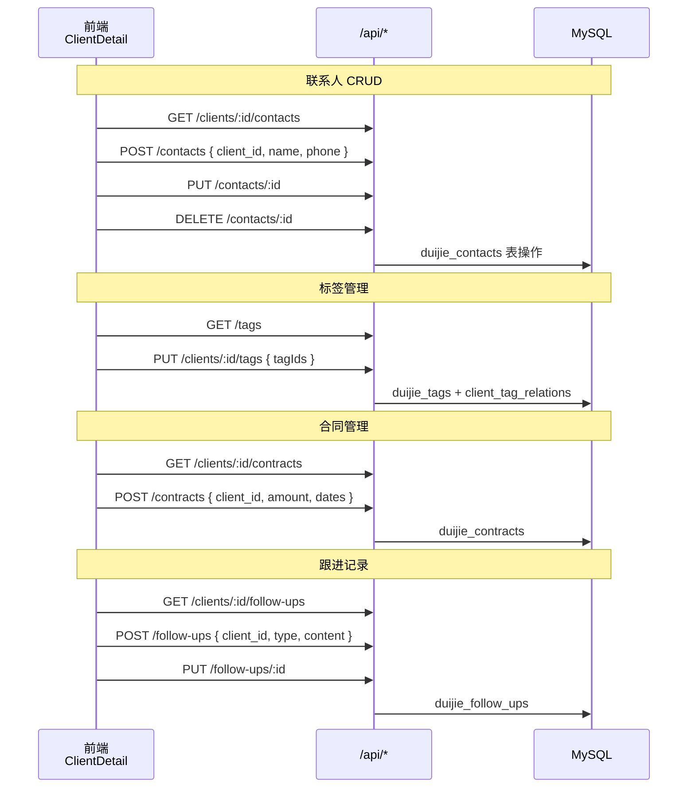
```mermaid
sequenceDiagram
    participant FE as 前端<br/>ClientDetail
    participant API as /api/*
    participant DB as MySQL

    Note over FE,DB: 联系人 CRUD
    FE->>API: GET /clients/:id/contacts
    FE->>API: POST /contacts { client_id, name, phone }
    FE->>API: PUT /contacts/:id
    FE->>API: DELETE /contacts/:id
    API->>DB: duijie_contacts 表操作

    Note over FE,DB: 标签管理
    FE->>API: GET /tags
    FE->>API: PUT /clients/:id/tags { tagIds }
    API->>DB: duijie_tags + client_tag_relations

    Note over FE,DB: 合同管理
    FE->>API: GET /clients/:id/contracts
    FE->>API: POST /contracts { client_id, amount, dates }
    API->>DB: duijie_contracts

    Note over FE,DB: 跟进记录
    FE->>API: GET /clients/:id/follow-ups
    FE->>API: POST /follow-ups { client_id, type, content }
    FE->>API: PUT /follow-ups/:id
    API->>DB: duijie_follow_ups
```

## 四、数据库表关系概览

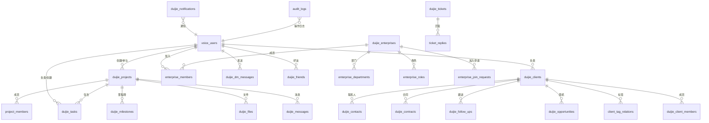
```mermaid
erDiagram
    voice_users ||--o{ duijie_projects : "创建/参与"
    voice_users ||--o{ duijie_clients : "负责"
    voice_users ||--o{ duijie_tasks : "负责/创建"
    voice_users ||--o{ enterprise_members : "加入"
    voice_users ||--o{ duijie_dm_messages : "发送"
    voice_users ||--o{ duijie_friends : "好友"
    
    duijie_projects ||--o{ project_members : "成员"
    duijie_projects ||--o{ duijie_tasks : "包含"
    duijie_projects ||--o{ duijie_milestones : "里程碑"
    duijie_projects ||--o{ duijie_files : "文件"
    duijie_projects ||--o{ duijie_messages : "消息"
    
    duijie_clients ||--o{ duijie_contacts : "联系人"
    duijie_clients ||--o{ duijie_contracts : "合同"
    duijie_clients ||--o{ duijie_follow_ups : "跟进"
    duijie_clients ||--o{ duijie_opportunities : "商机"
    duijie_clients ||--o{ client_tag_relations : "标签"
    duijie_clients ||--o{ duijie_client_members : "成员"
    
    duijie_enterprises ||--o{ enterprise_members : "成员"
    duijie_enterprises ||--o{ enterprise_departments : "部门"
    duijie_enterprises ||--o{ enterprise_roles : "角色"
    duijie_enterprises ||--o{ enterprise_join_requests : "加入申请"
    
    duijie_tickets ||--o{ ticket_replies : "回复"
    duijie_notifications }o--|| voice_users : "通知"
    audit_logs }o--|| voice_users : "操作日志"
```

## 五、部署架构

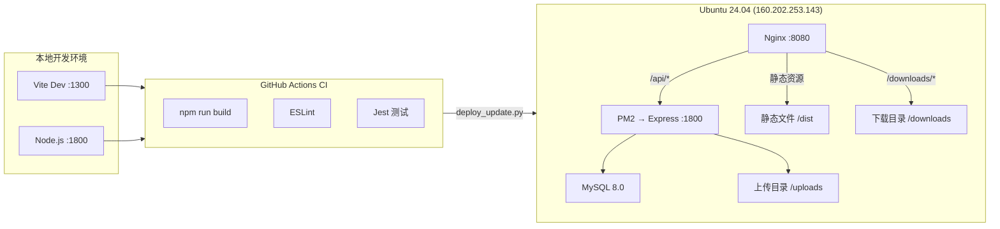
```mermaid
graph LR
    subgraph 本地开发["本地开发环境"]
        DEV_FE["Vite Dev :1300"]
        DEV_BE["Node.js :1800"]
    end
    
    subgraph CI["GitHub Actions CI"]
        BUILD["npm run build"]
        LINT["ESLint"]
        TEST["Jest 测试"]
    end
    
    subgraph 生产服务器["Ubuntu 24.04 (160.202.253.143)"]
        NGINX_PROD["Nginx :8080"]
        PM2["PM2 → Express :1800"]
        MYSQL_PROD["MySQL 8.0"]
        STATIC["静态文件 /dist"]
        UPLOADS["上传目录 /uploads"]
        DOWNLOADS["下载目录 /downloads"]
    end
    
    DEV_FE --> CI
    DEV_BE --> CI
    CI -->|deploy_update.py| 生产服务器
    
    NGINX_PROD -->|/api/*| PM2
    NGINX_PROD -->|静态资源| STATIC
    NGINX_PROD -->|/downloads/*| DOWNLOADS
    PM2 --> MYSQL_PROD
    PM2 --> UPLOADS
```
